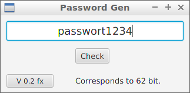
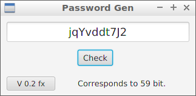

# Password-Strength #

Evaluates passwords based on their character set and rates that
password in the binary system and its bit strength.

## Copyright ##

    Copyright (c) 2018 Georg Schmidt
    All rights reserved

## Recommending passwords ##

- Numbers, upper and lowercase letter:
   - 22 chars ≈ 128 bit
   - 43 chars ≈ 256 bit
- Numbers, upper and lowercase letter, 17 special chars:
   - 21 chars ≈ 128 bit
   - 41 chars ≈ 256 bit

As you can see special chars do not help much.

## Version Releases
- **Version 0.1**
   - cli only
- **Version 0.2**
   - GUI JavaFX added

## Pre-View

As you can see to **use** this tool, your password **must** be chosen **randomly !!!**

This tool is to designed to check **randomly chosen passwords** on there complexity.

This password is hacked in < 1 second and does not need to test 62 bit **!**

Bad password:

Good password:

